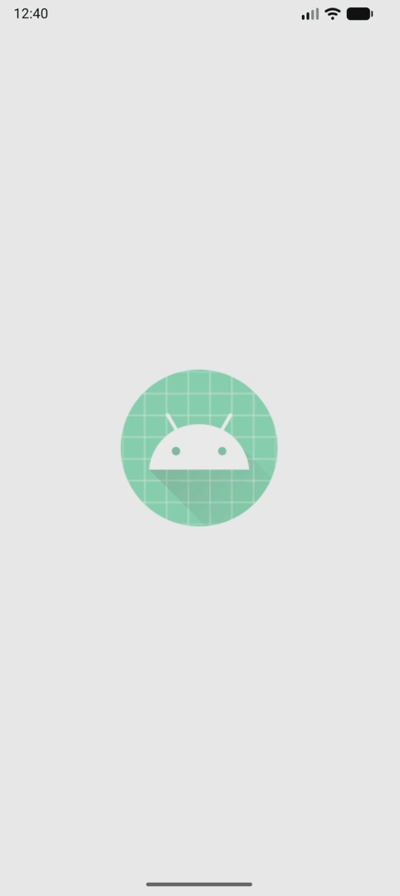
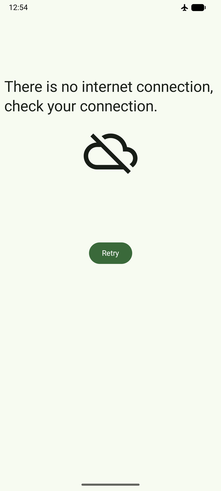

# Amphibians app
The main purpose of this app is to get information from the server, parse JSON and display images with text.

**Source code:**
[Browse the app package on GitHub ](https://github.com/IlgarM4224/Amphibians-app/tree/main/app/src/main/java/com/example/amphibiansapp)

## Visuals

Home page                                                         |                                                        Error page |
|:----------------------------------------------------------------|------------------------------------------------------------------:|
| | |

### Home page on tablet

## Tech Stack & Architecture

- **Language:** [Kotlin](https://kotlinlang.org/)
- **UI Framework:** [Jetpack Compose](https://developer.android.com/jetpack/compose) (Declarative UI)
- **Libraries** [Retrofit](https://square.github.io/retrofit/), [Coil](https://coil-kt.github.io/coil/)
- **Architecture:** MVVM Pattern (Model-View-ViewModel), Dependency Injection, Repository
- **Server** [API](https://android-kotlin-fun-mars-server.appspot.com/amphibians)
